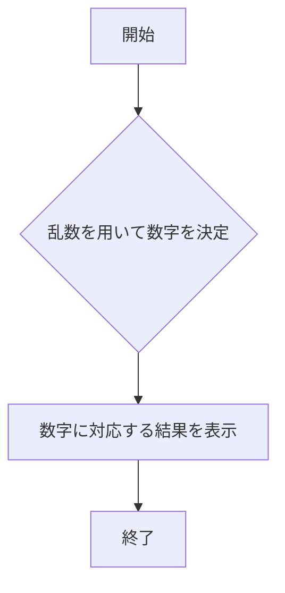

# webpro_06
## 24G1114 日暮太志

## このプログラムについて

## ファイル一覧
ファイル名 | 説明
-|-
app5.js | プログラム本体
public/janken.html | じゃんけんの開始画面
public/suziate.html | 数字当ての開始画面
public/seiza.html | 星座占いの開始画面
views/janken.ejs | じゃんけんの結果表示画面
views/suziate.ejs | 数字当ての結果表示画面
views/seiza.ejs | 星座占いの結果表示画面

## ジャンケンのプログラム

### 起動方法
1:以下のコマンドでサーバを立ち上げる．
```javascript
node app5.js
```
2:以下のURLでページを開く．
http://127.0.0.1:8080/public/janken.html

3:自分の出したい手を入力し送信する．

### 使用手順
1:自分の出したい手を入力し送信する．
2:サーバからの返信をみて，試合数や勝数を確認する．
3:必要に応じて次の手を送信する．

### 機能の説明

#### janken.html
開始画面を表示するプログラム．inputを用いて入力画面を表示している．

#### janken.ejs
結果画面を表示するプログラム．htmlで試合数や勝数を表示し，inputを用いて入力画面を表示している．

#### app5.js
乱数を用いてランダムに数字を選び，選んだ数字に対応する結果を表示する．ジャンケンの場合，出す手を乱数を用いて決める．

### フローチャート



## 数字当てのプログラム

### 起動方法
1:以下のコマンドでサーバを立ち上げる．
```javascript
node app5.js
```
2:以下のURLでページを開く．
http://127.0.0.1:8080/public/suziate.html

3:自分の出したい数字を入力し送信する．

### 使用手順
1:自分の出したい数字を入力し送信する．
2:サーバからの返信をみて，問題数や正解数を確認する．
3:必要に応じて次の数字を送信する．

### 機能の説明

#### suziate.html
開始画面を表示するプログラム．inputを用いて入力画面を表示している．

#### suziate.ejs
結果画面を表示するプログラム．htmlで問題数や正解数を表示し，inputを用いて入力画面を表示している．

#### app5.js
乱数を用いてランダムに数字を選び，選んだ数字に対応する結果を表示する．数字当ての場合，出す数字を乱数を用いて決める．

### フローチャート


## 星座占いのプログラム

### 起動方法
1:以下のコマンドでサーバを立ち上げる．
```javascript
node app5.js
```
2:以下のURLでページを開く．
http://127.0.0.1:8080/public/seiza.html

3:自分の星座を入力し送信する．

### 使用手順
1:自分の星座を入力し送信する．
2:サーバからの返信をみて，今日の運勢を確認する．

### 機能の説明

#### seiza.html
開始画面を表示するプログラム．inputを用いて入力画面を表示している．

#### seiza.ejs
結果画面を表示するプログラム．htmlで結果を表示している．

#### app5.js
乱数を用いてランダムに数字を選び，選んだ数字に対応する結果を表示する．星座占いの場合，占い結果を乱数を用いて決める．

### フローチャート


