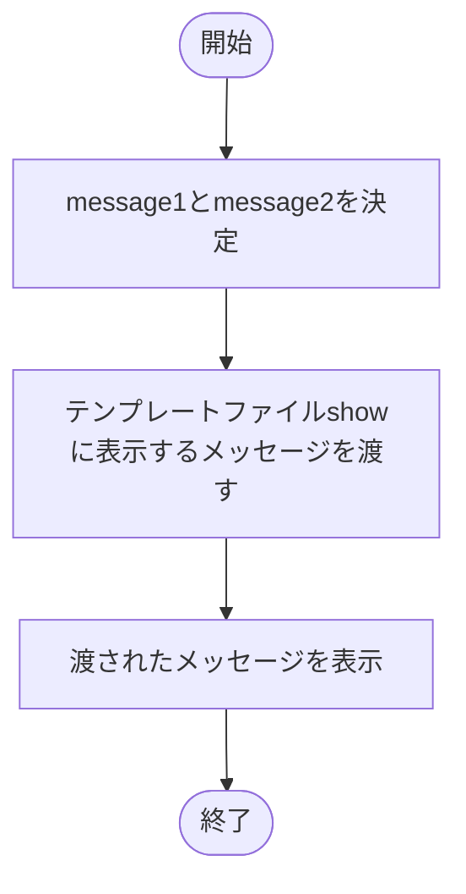
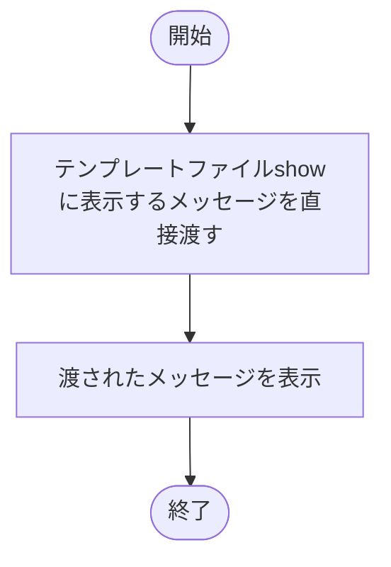
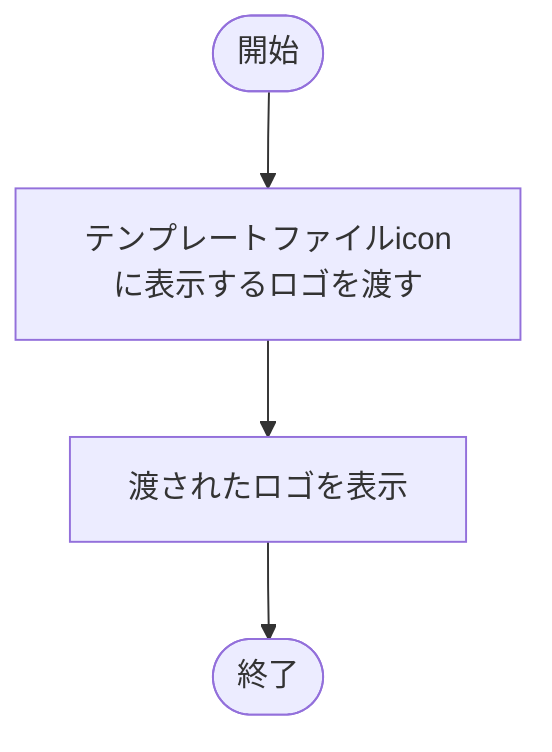
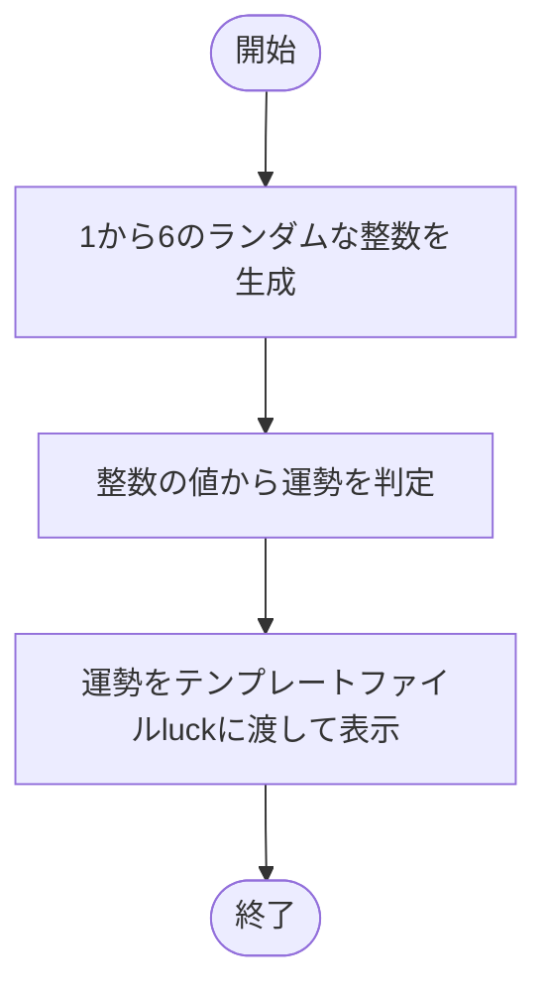
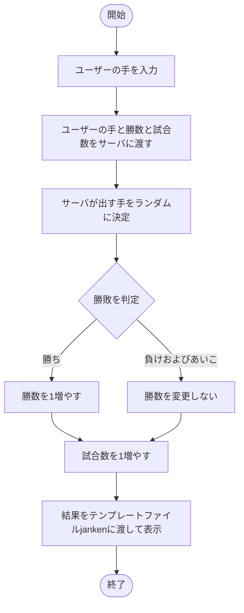
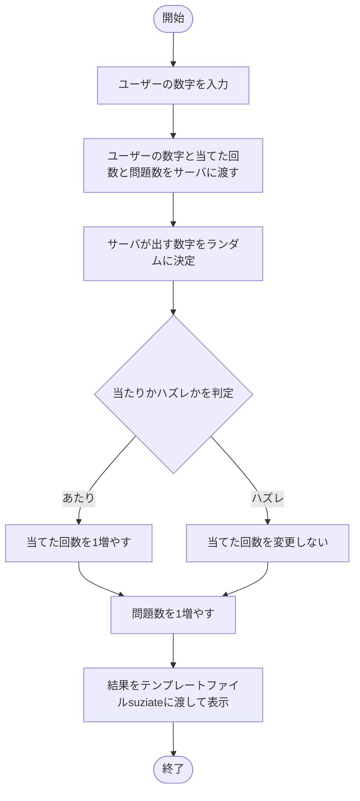
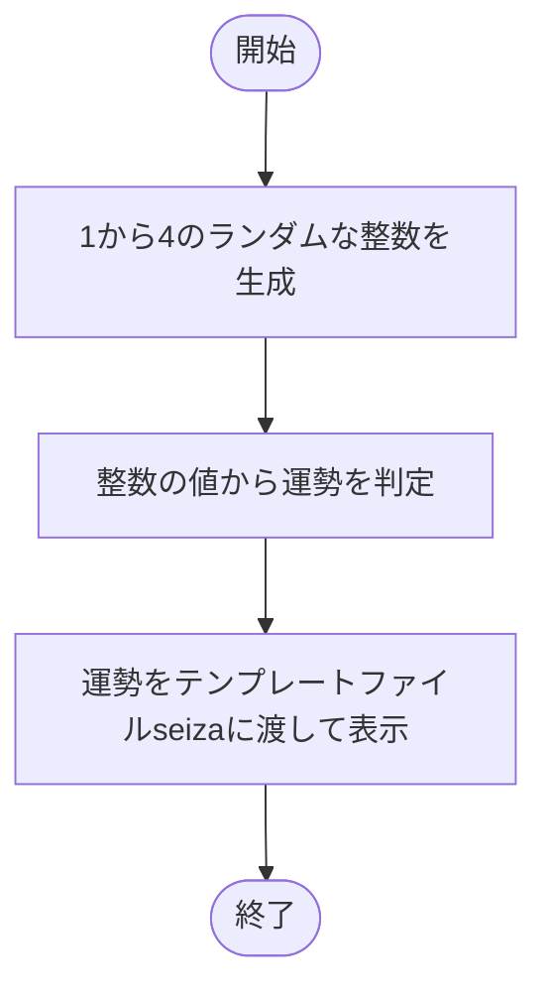

# webpro_06
## 24G1114 日暮太志

## このプログラムについて

## ファイル一覧
ファイル名 | 説明
-|-
app5.js | プログラム本体
public/show.ejs | メッセージの表示画面
public/icon.ejs | アイコンの表示画面
public/luck.ejs | おみくじの結果表示画面
public/janken.html | じゃんけんの開始画面
public/suziate.html | 数字当ての開始画面
public/seiza.html | 星座占いの開始画面
views/janken.ejs | じゃんけんの結果表示画面
views/suziate.ejs | 数字当ての結果表示画面
views/seiza.ejs | 星座占いの結果表示画面

## hello1

### 起動方法
1:以下のコマンドでサーバを立ち上げる．
```javascript
node app5.js
```
2:以下のURLでページを開く．
http://localhost:8080/hello1

### 機能の説明
まず，変数```message1```，```message2```にそれぞれ```"Hello world"```，```"Bon jour"```というメッセージを格納する．
次に，```res.render```を用いてテンプレートファイル```'show'```を指定する．
最後に，```{greet1:message1, greet2:message2}```をテンプレートファイル```'show'```に渡し，メッセージを表示する．

### フローチャート


## hello2

### 起動方法
1:以下のコマンドでサーバを立ち上げる．
```javascript
node app5.js
```
2:以下のURLでページを開く．
http://localhost:8080/hello2

### 機能の説明
まず，```res.render```を用いてテンプレートファイル```'show'```を指定する．
次に，```{greet1:"Hello world", greet2:"Bon jour"}```をテンプレートファイル```'show'```に渡し，メッセージを表示する．

### フローチャート



## icon

### 起動方法
1:以下のコマンドでサーバを立ち上げる．
```javascript
node app5.js
```
2:以下のURLでページを開く．
http://localhost:8080/icon

### 機能の説明
まず，```res.render```を用いてテンプレートファイル```'icon'```を指定する．
次に，```{ filename:"./public/Apple_logo_black.svg", alt:"Apple Logo"}```をテンプレートファイル```'icon'```に渡し，ロゴを表示する．

### フローチャート




## luck

### 起動方法
1:以下のコマンドでサーバを立ち上げる．
```javascript
node app5.js
```
2:以下のURLでページを開く．
http://localhost:8080/luck

### 機能の説明
まず，```Math.random()```を用いて1から6の整数をランダムで生成し，```num```に格納する．
次に，```num```の値と運勢をそれぞれ，1と大吉，2と中吉，3と吉，4と小吉，5と末吉，6と大吉で対応させて運勢を決める．
最後に，```res.render```を用いてテンプレートファイル```'luck'```を指定し，```{number:num, luck:luck}```を渡して運勢を表示する．
```{number:num, luck:luck}```において，```number```は生成した整数，```luck```は表示する運勢を表している．

### フローチャート



## ジャンケンのプログラムに関する説明

## janken

### 起動方法
1:以下のコマンドでサーバを立ち上げる．
```javascript
node app5.js
```
2:以下のURLでページを開く．
http://127.0.0.1:8080/public/janken.html


### 使用手順
1:自分の出したい手を入力し送信することでジャンケンをする．
2:サーバからの返信をみて，試合数や勝数を確認する．
3:ジャンケンを続ける場合，次の手を送信する．

### 機能の説明
まず，ユーザーの入力について説明する．ユーザーはグー，チョキ，パーの中から自分の出す手を決めて入力する．ユーザーの出す手を```hand```，ユーザーの勝数を```win```，ジャンケンの試合数を```total```としてサーバに渡す．
次に，サーバの処理について説明する．乱数を用いてランダムにコンピュータの出す手を決定し，ユーザーの出した手と比較して勝敗を判定する．この結果からユーザーの勝数と試合数を更新する．
最後に，ユーザーの手，コンピュータの手，勝敗，試合数と勝数を表示する．

### フローチャート


## 数字当てのプログラムに関する説明

## suziate

### 起動方法
1:以下のコマンドでサーバを立ち上げる．
```javascript
node app5.js
```
2:以下のURLでページを開く．
http://127.0.0.1:8080/public/suziate.html

### 使用手順
1:自分の出したい数字を入力し送信する．
2:サーバからの返信をみて，問題数や正解数を確認する．
3:数字当てを続ける場合，次の数字を送信する．

### 機能の説明

まず，ユーザーの入力について説明する．ユーザーは1から6の中から好きな数字を選び入力する．ユーザーの選んだ数字を```sainome```，ユーザーの当てた回数を```win```，数字当ての問題数を```total```としてサーバに渡す．
次に，サーバの処理について説明する．乱数を用いてランダムにコンピュータの出す数字を決定し，ユーザーの選んだ数字と比較して当たりかハズレかを判定する．この結果からユーザーの当てた回数と問題数を更新する．
最後に，ユーザーの選んだ数字，コンピュータの選んだ数字，当たりかハズレか，問題数と当てた回数を表示する．

### フローチャート


## 星座占いのプログラムに関する説明

## seiza

### 起動方法
1:以下のコマンドでサーバを立ち上げる．
```javascript
node app5.js
```
2:以下のURLでページを開く．
http://127.0.0.1:8080/public/seiza.html


### 使用手順
1:自分の星座を入力し送信する．
2:サーバからの返信をみて，今日の運勢を確認する．

### 機能の説明
まず，ユーザーの入力について説明する．ユーザーは自分の星座を入力する．
次に，サーバの処理について説明する．乱数を用いてランダムに運勢を決定する．
最後に，運勢を表示する．


### フローチャート


